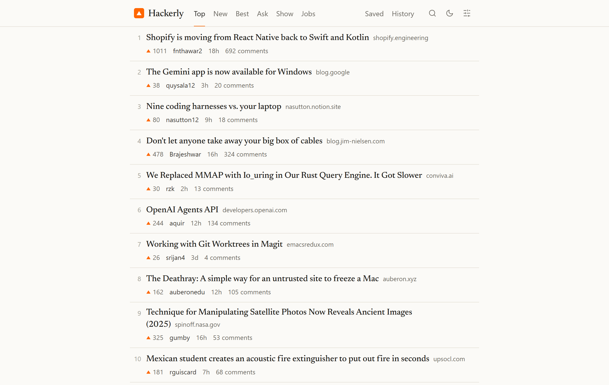
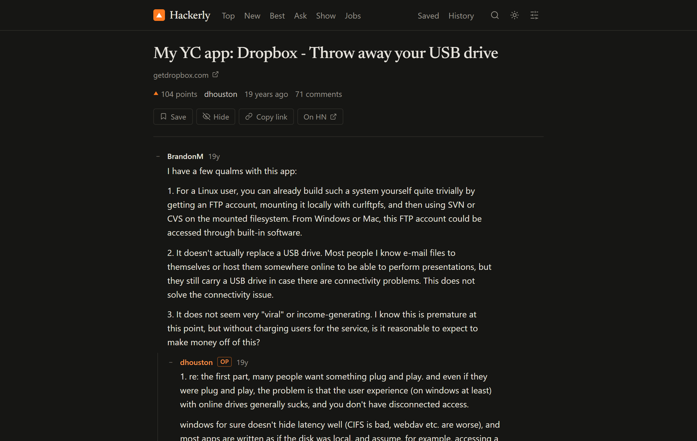

<p align="center">
  
</p>
<h1 align="center">Hackerly</h1>
<p align="center">A calm, keyboard-first reader for Hacker News.</p>
<p align="center"><a href="https://hackerly.vercel.app"><strong>hackerly.vercel.app</strong></a></p>

<br>



Hacker News has the best community on the web and a front end from 2007. Hackerly keeps the stories, the comments and the ranking exactly as they are, and rethinks how they read: editorial typography, a comment tree you can actually follow, a proper dark theme, and a keyboard that does everything.

## Features

- **Every feed.** Top, New, Best, Ask, Show and Jobs, with Hacker News’ own ranking and pagination.
- **Comments you can follow.** Threaded replies with indentation guides, collapse a comment or a whole thread with one click, author badges, and markers on comments posted since your last visit.
- **Keyboard first.** `j`/`k` move, `o` opens the article, `c` the comments, `s` saves, `x` collapses, `J`/`K` jump between threads, `g` chords switch feeds. Press `?` anywhere for the full list.
- **Search and commands.** `/` or `⌘K` opens a palette that searches every story ever posted and jumps to any page.
- **Reading preferences.** Light, dark or system theme. Text size, line height, content width, serif or sans comments, feed density, reply indentation, relative or absolute timestamps, and whether story titles open the article or the discussion.
- **Yours, locally.** Saved stories and comments, reading history, hidden stories and collapsed threads live in your browser. No account, no cookies; page views are counted anonymously with Vercel Analytics, and nothing you save ever leaves your device.
- **Fast.** Server-rendered and edge-cached pages, prefetching as you hover, and progressive loading for discussions with thousands of comments.
- **Hacker News URLs work.** Swap the domain and `/item?id=…`, `/user?id=…` or `/newest` land on the right page.



## Keyboard shortcuts

| Key | Action |
| --- | --- |
| `j` / `k` | Next / previous story or comment |
| `J` / `K` | Next / previous thread |
| `p` | Parent comment |
| `↵` | Open story, like clicking its title |
| `o` / `c` | Open the article / the comments |
| `x` | Collapse or expand a comment |
| `s` / `h` / `m` | Save / hide / mark read |
| `u` / `y` | Author profile / copy link |
| `g` then `h` `n` `b` `a` `s` `j` | Top, New, Best, Ask, Show, Jobs |
| `g` then `l` `y` `p` | Saved, History, Preferences |
| `/` or `⌘K` | Search and commands |
| `t` / `r` / `?` | Toggle theme / refresh / this list |
| `Esc` | Back to the feed |

## Running locally

```sh
npm install
npm run dev          # http://localhost:3000
```

```sh
npm test             # sanitizer tests
npm run typecheck
npm run build        # production build in .output/
```

## Deploying

The live site runs on [Vercel](https://vercel.com): import the repository and deploy. Nuxt detects the platform, the route rules in `nuxt.config.ts` cache rendered pages at the edge with background revalidation, and Vercel Analytics and Speed Insights are enabled through their Nuxt modules. Any Node host works too: `npm run build`, then `node .output/server/index.mjs`.

## How it works

Nuxt 4, Vue 3, TypeScript and Tailwind CSS 4, with the [Newsreader](https://fonts.google.com/specimen/Newsreader) typeface self-hosted. No component library, no state library, no database.

- `server/api/` proxies the official [Hacker News API](https://github.com/HackerNews/API) with in-memory caching and a concurrency cap. Comment threads arrive in budgeted batches, so a 2,000-comment discussion renders progressively instead of all at once.
- `shared/utils/sanitize.ts` rebuilds Hacker News’ HTML from a small allowlist before anything reaches the page, and rewrites `news.ycombinator.com` links to local routes.
- `server/api/search.get.ts` uses [Algolia’s HN Search API](https://hn.algolia.com), since the official API has no full-text search. It is the only file to touch for a different provider.
- `app/composables/usePrefs.ts` and `useLocal.ts` keep preferences and local data in `localStorage`. A tiny inline script applies theme and typography before first paint, so there is no flash.
- `app/composables/useKeys.ts` and `useSelection.ts` provide the shortcut registry, `g` chords and the list cursor shared by feeds and comment trees.

## Acknowledgements

Stories and comments come from the public Hacker News API; search from Algolia. Hackerly is an independent project, not affiliated with or endorsed by Y Combinator or Hacker News.

## License

[MIT](LICENSE)
